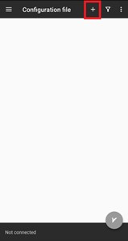

&rlm;
#  آموزش تنظیم فیلترشکن روی گوشی

بعد از اینکه کد فعال سازی فیلتر شکن رو دریافت کردید میتونید با این راهنما فیلتر شکن رو نصب و تنظیم کنید. اگر لینک فعال سازی ندارید باید اول با استفاده از [راهنمای ساخت ](../ServerSide/ServerSide.md)، فیلتر شکن رو بسازید یا از دوستانتون بخواهید براتون بسازند. 

<p align="center" width="100%">
 
</p>


## نکته اول: فیلترشکن رو به اشتراک نگذاری!
این فیلترشکن رو فقط برای خودتون (یک نفر) راه‌اندازی کنید. برای اشتراک گذاری اون با افراد دیگه (حتی خانواده و دوستان نزدیک)، حتما از قبل با فردی که ازش لینک رو گرفتید هماهنگ کنید. در غیر این صورت سیستم کند و فیلتر میشه.

## نکته دوم: دانلود غیر‌قانونی!
خارج از فضای تلگرام و واتس‌اپ و توییتر و اینستا به هیچ وجه دانلود نکنید. به خصوص از نرم افزار تورنت نباید استفاده کنید. به طور کلی هر اثری که در بازار داره به فروش می‌رسه رو، نباید با این فیلترشکن دانلود کرد. در غیر این صورت فردی که به شما این فیلترشکن رو داده مورد پیگرد قانونی قرار میگیره.  


# طریقه نصب و راه اندازی برای گوشی اندرویدی و در ادامه آیفون‌. 
## برای گوشی‌های اندرویدی 

ابتدا باید  [نرم افزار v2rayNG ](https://play.google.com/store/apps/details?id=com.v2ray.ang) رو دانلود و نصب کنید:

<p align="center" width="100%">
 
</p>


اگر به گوگل پلی دسترسی ندارید می‌تونید فایل رو از  [گوگل درایو ](https://drive.google.com/file/d/1I3tqnuCb30yhjFdp6Ab9xn5lLO8v1SKs/view?usp=sharing) دانلود کنید. بعد از دانلود موفق فایل، نصبش کنید.

### راه‌اندازی


1.  قبل از باز کردن نرم افزار کد که فرستاده شده و شبیه اینه رو کپی کنید:

```
 vmess://eyF5IiwgInRsF5IiwgInRsF5IiwgInRsF5IiwgInRsF5IiwgInRsF5IYycmF5IiwgInRscyI6IiIsICJ0eXBlIjoibm9uZSIsICJ2IjoiMiJ9Cg==
````

2.  بعد وارد نرم افزار بشید و دکمه + رو از نوار بالا انتخاب کنید.

<p align="center" width="100%">
 
</p>


3. از لیستی که باز میشه Import config from Clipboard رو انتخاب کن.

<p align="center" width="100%">
 
</p>


4.  بعد باید همچین چیزی روی صفحه اومده باشه. البته آدرس داخل کادر قرمز ممکنه فرق کنه چون این تصویر فقط برای آموزش تهیه شده:

<p align="center" width="100%">
 
</p>


5. مرحله آخر دکمه طوسی رنگ V رو می‌زنید تا کانکت (متصل) بشید.

<p align="center" width="100%">
 
</p>


6.  بعد از این قسمت، دکمه طوسی سبز می‌شه و پایین نرم افزار می‌نویسه:
connected, tap to check connection 
امتحان کنید ببینید وصل هستید یا نه. اگر تونستید به اینستاگرام، واتس‌اپ و سایر سرویس‌هایی که فیلتر هستند، دسترسی داشته باشید که کارتون اینجا تموم میشه.


اگر اتصال نداشتید برگردید به نرم افزار و روی نوشته‌ی:
 connected, tap to check connection 
بزنید. اگر مشکل اتصال داشته باشید این پیغام رو بعد از این‌که یک مدت روی (Testing…) می‌مونه نشون می‌ده:
Fail to detect internet connection: io:read/write on closed pipe
در صورتی که به سایت‌ها یا سرویس‌های فیلتر شده دسترسی نداشتید به کسی که این راهنمارو براتون فرستاده اطلاع بدید تا راهنماییتون کنه.
بازهم تأکید می‌کنیم که حواستون به حق ناشرها باشه و فیلم و آهنگ دانلود نکنید چون در این صورت کسی که وی پی ان رو براتون ساخته مورد پیگرد قانونی قرار می‌گیره.


## برای آیفون

ابتدا باید نرم افزار  [ShadowLink ](https://apps.apple.com/us/app/shadowlink-shadowsocks-vpn/id1439686518) از اپ‌استور دانلود و نصب کنید:

<p align="center" width="100%">
 
</p>

نکته: در صورت فیلتر بودن اپ‌استور و عدم دسترسی به فیلترشکن دیگر، شما میتونید از طریق یک گوشی اندرویدی واسطه و دارای فیلترشکن، موقتا به اپ‌استور وصل شده و این نرم‌افزار را نصب کنید. راهنمای این کار را در  [این پست کانال تلگرام ](https://t.me/freeNet4Iran/34)  پیدا کنید. 
 
1. وارد نرم افزار بشید و دکمه ضربدر×  رو بزنید تا تبلیغ رد بشه و وارد صفحه اصلی بشید. 
<p align="center" width="100%">
 
</p>

2. در صفحه اصلی روی نوار خالی (Server) بزنید.

<p align="center" width="100%">
 
</p>


3. بعد از انتخاب My Server، علامت + گوشه تصویر رو انتخاب کنید. 

<p align="center" width="100%">
 
</p>


4. سپس از لیست باز شده گزینه Server links رو انتخاب کنید.

<p align="center" width="100%">
 
</p>


5. سپس کدی که برایتان ارسال شده را باید داخل کادر سفید paste کنید و Save رو بزنید. 

<p align="center" width="100%">
 
</p>


نمونه کد: 
```
vmess://eygInRscyI6IiIgInRscyI6IiIgInRscyI6IiIgInRscyI6IiIgInRscyI6IiIgInRscyI6IiIgInRscyI6IiIYycmF5IiwgInRscyI6IiIsICJ0eXBlIjoibm9uZSIsICJ2IjoiMiJ9Cg==
```

6. دایره‌ی سفید (داخل مربع قرمز در تصویر) را انتخاب کنید.
<p align="center" width="100%">
 
</p>


7. در نهایت در صفحه اصلی روی دکمه با علامت پاور بزنید. اگر دایره دور دکمه با علامت پاور آبی رنگ باشه یعنی فیلترشکن‌تون وصله و اگر طوسی رنگ باشه یعنی قطعه. در صورتی که به سایت‌ها یا سرویس‌های فیلتر شده دسترسی نداشتید به کسی که این راهنما رو براتون فرستاده اطلاع بدید تا راهنماییتون کنه. 

<p align="center" width="100%">
 
</p>


* در صورتی که به سایت‌ها یا سرویس‌های فیلتر شده دسترسی نداشتید به کسی که این راهنمارو براتون فرستاده اطلاع بدید تا راهنماییتون کنه.
* بازهم تأکید می‌کنیم که حواستون به حق ناشرها باشه و فیلم و آهنگ دانلود نکنید چون در این صورت کسی که وی پی ان رو براتون ساخته مورد پیگرد قانونی قرار می‌گیره.
 


## رفع اشکالات

در صورتی که در فرایند نصب به مشکلی برخوردید میتوانید در بالای همین صفحه یک [Issue](https://github.com/freeNet4Iran/simple_v2ray_setup/issues) باز کنید.


## ارتباط با ما

[تلگرام](https://t.me/freeNet4Iran)

[گیت هاب](https://github.com/freeNet4Iran/simple_v2ray_setup)

[توییتر](https://twitter.com/4freenetiran)

[پشتیبانی تلگرام](https://t.me/FreeNet4IranSupport)

&rlm;

### Todo List

- [ X ] add pictures of clients icons
- [ X ] add pictures of steps
- [ X ] check Links


