&rlm;
#  نمای کلی

شما میتونید بدون کوچکترین اطلاعات فنی و برای دو ماه، رایگان برای آشناهاتون فیلتر شکن درست کنید. این روش هم برای شما امنه و ناشناس میمونید و هم برای کسی که استفاده میکنه امن هست. این یک روش متداول برای افزایش امنیت و دسترسی آزاد به اینترنت هست.  

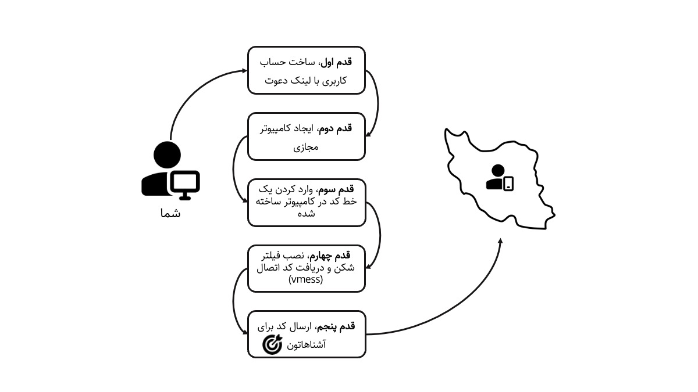


## قدم اول: ایجاد حساب کابری 
اینجا به طور خلاصه روند ایجاد حساب کاربری رو در شرکت دیجیتال اوشن (Digital Ocean) توضیح می‌دیم. 
اول از این لینک دعوت (https://m.do.co/c/c002525064da) یا لینک دعوت دوستاتون وارد سایت دیجیتال اوشن بشید. نکته مهم اینه که حتما با یک لینک دعوت حساب کاربری بسازید تا 200 دلار اعتبار هدیه به شما تعلق بگیره. 
می‌تونید با حساب کاربری گوگل و یا ایمیل، یک حساب کاربری بسازید. البته برای پرداخت به کارت بانکی یا گیفت کارت خارجی و یا پی پال نیاز هست. 


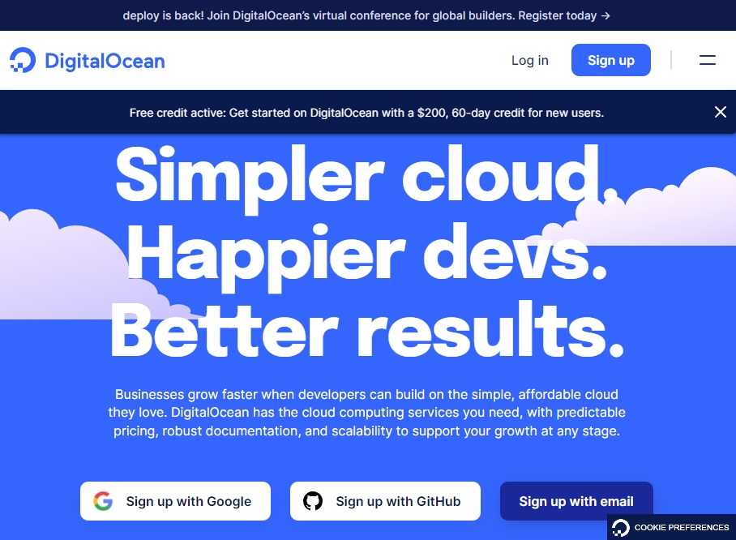


دقت کنید بالای صفحه به شما گفته 200 دلار اعتبار هدیه در راه است. تو این مرحله باید یک روش پرداخت مثل کارت بانکی و یا پی پال معرفی کنید. احتمالا برای شروع 5 دلار شارژتون می‌کنه که البته میتونید بعدا درخواست بدید به حسابتون برگرده. 

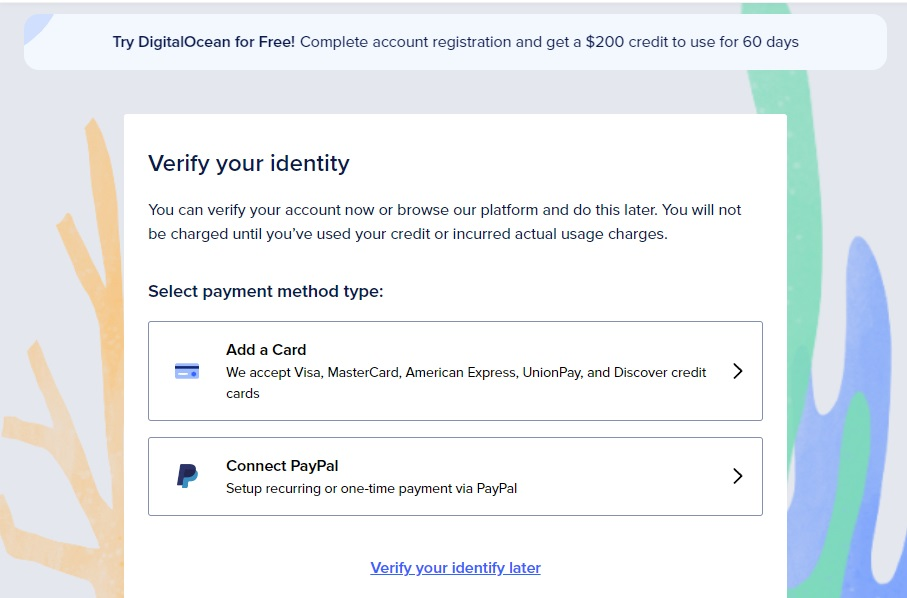

## قدم دوم: ایجاد کامپیوتر مجازی
در مرحله بعدی رو گزینه Deploy a virtual machine کلیک کنید.

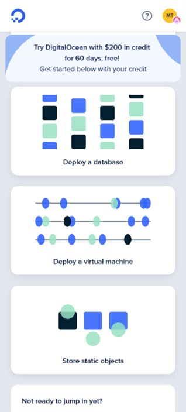


حالا در این صفحه تنظیمات رو به شکل زیر انجام می‌دیم (طبق عکس صفحه بعد). 

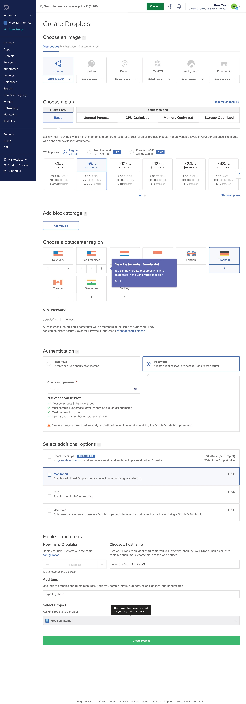

۱) سیستم عامل اوبونتو نسخه 22.04

۲) پلان Basic 

۳) از نوع Regular with SSD 

۴) گزینه 6 دلار در ماه

۵) محل دیتا سنتر Frankfurt (البته میتونه جاهای دیگه هم باشه.) 

۶) نوع Authentication  با Password و اینکه باید پسورد وارد بشه که حروف بزرگ و کوچیک و اعداد و کاراکترهای خاص داشته باشه و اخرش با حرف تموم بشه و نه با عدد یا کاراکتر خاص. مثلا wFg7WdxC3DVHn

۷) از قسمت additional options گزینه monitoring  رو فعال کرد. 

۸) نهایت اینکه پایین صفحه گزینه سبز رنگ  create droplet رو بزنید و صبر کنید تا ساخته بشه.


کمتر از یک دقیقه منتظر بشید تا نصب انجام بشه و نوار آبی رنگ پر بشه تا این صفحه رو ببینید:
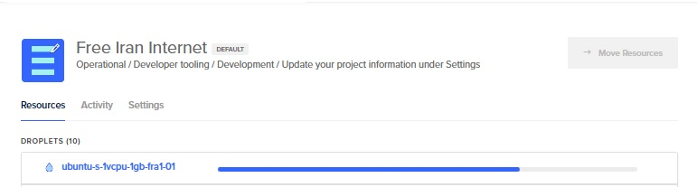

حالا روی سه نقطه سمت راست کلیک کنید و گزینه Access Console رو بزنید.
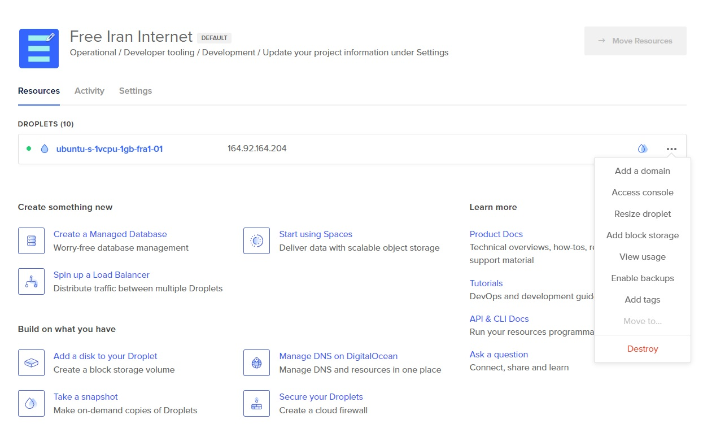

بعد گزینه آبی رنگ Launch Droplet Console رو بزنید.       
حالا باید پنجره ای شبیه به این داشته باشید.

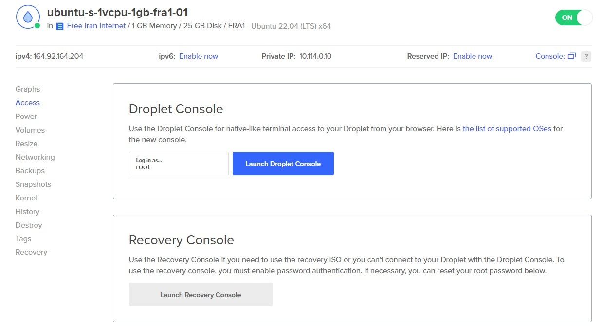

این کد رو کامل کپی کنید و مثل عکس زیر، وسط پنجره سیاه باز شده (کنسول) با راست کلیک paste کنید و بعد وenter بزنید (با control + V نمیشه) .  

```
curl https://raw.githubusercontent.com/SonyaCore/V2RayGen/main/V2RayGen.py | sudo python3 - --vmess
``` 
[Credit @Sonya](https://github.com/SonyaCore/V2RayGen)

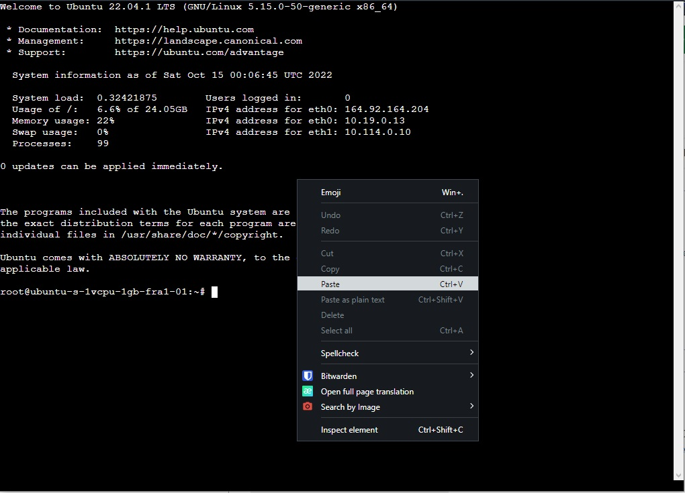

برنامه شروع به نصب می‌کنه. این کار حدود یک دقیقه زمان میبره. صفحه خط به خط تغییر می‌کنه تا در پایان نصب همه چیز ثابت می‌شه و لینک مورد نظر نمایش داده می‌شه.

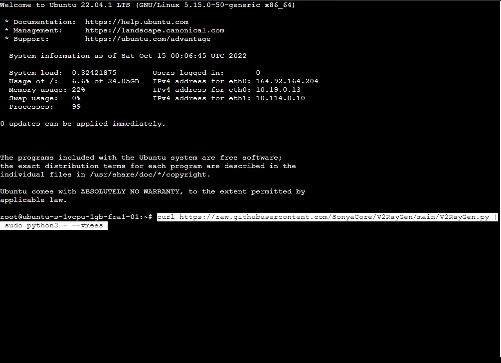

در صورتی که نصب موفق بود در پایین صفحه یک کد که با عبارت vmess:// شروع می‌شه، به ما نشون داده میشه. کدی که در عکس مشخص شده کد مربوط به فیلتر شکن هست و باید برای کاربر ارسال شود. این کد را حتما جایی نگهداری کنید چون دوباره به آن دسترسی نخواهید داشت. در صورتی که در پایان کد مورد نظر را دریافت نکردید، دوباره کد را paste کنید وenter بزنید. 

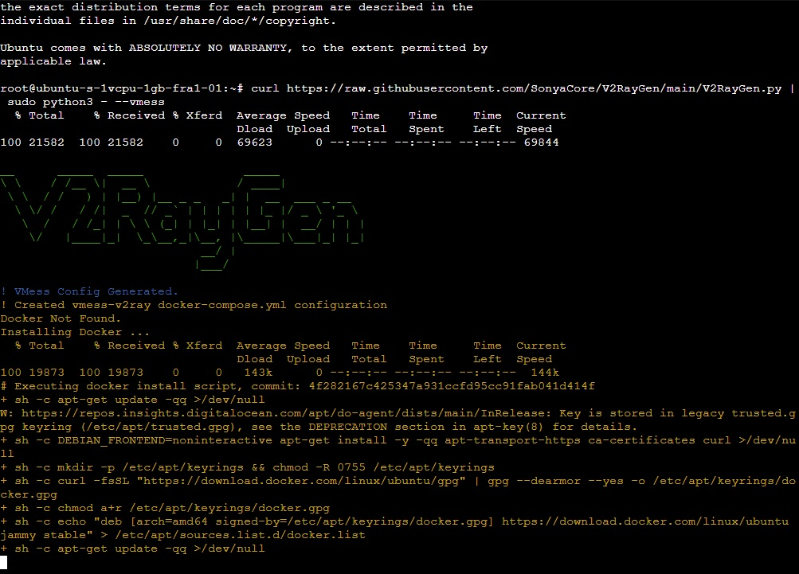


بعد از این مرحله می‌تونید با نرم افزارهای زیر کد رو رو گوشی تنظیم و استفاده کنید. برای این منظور راهنمای دیگری در [گوگل درایو](https://github.com/SonyaCore/V2RayGen) و [پیت هاب](./ClientAndroidIOS/ClientAndroidIOS.md) قابل دسترسی است.
  لینک راهنما در گیت هاب و گوگل درایو


| لینک      | اپلیکیشن                                                           | سیستم عامل |  
|-----------------------------------------------------------------------|----------|------------|
| https://apps.apple.com/us/app/shadowlink-shadowsocks-vpn/id1439686518 |    ShadowLink       | IOS        | 
| https://play.google.com/store/apps/details?id=com.v2ray.ang           |       v2rayNG   | Android    |

 	


## سوالات متداول

1. ایا این سرویس برای من هزینه داره؟
  *	دو ماه اول نه. چون از اعتبار هدیه استفاده میشود. 
2.	بعد از دو ماه چی؟
  *		میتونید سرویس رو متوقف کنید و درخواست بدید هزینه اولیه هم برگرده به حسابتون
  *		هزینه های این سرویس ساعتی محاسبه میشود. یعنی اول ماه شما برای کل ماه شارج نمیشید. هر تعداد ساعتی که کامپیوتر مجازی داشته باشید شارج میشید. 
3.	ایا ممکنه ایران به من گیر بده؟
  *		نه. ایران اصلا متوجه این سرویس نمیشه. 
4.	آیا خطری برای کسایی که در ایران از این سرویس استفاده میکنند وجود دارد؟
  *		نه رمز نگاری میشه
5.	ایا این سرویس خطری برای کسی که راه اندازی میکنه داره؟
  *		به صورت کلی اصلا. اما جون سرویس خارجی هست به محتوای کپی رایت حساسه. این یعنی دانلود از تورنت و یا یوتوب نباید انجام بشه. گرچه محتوای داخلی تلگرام قابل رویت نیست. 
6.	آیا میشه کس دیگری برای ما این سرویس را راه اندازی کند؟
  *		بله. در صورتی که دسترسی به سرویس پرداخت خارجی دارد. 
7.	یک لینک رو با چند نفر میشه به اشتراک گذاشت؟
  *		روی کاغذ به بینهایت نفر. ولی توصیه میشه برای حفظ سرعت و اینکه فیلتر نشه کد رو به ده تا پونزده کاربر همزمان بدید. 
8.	اگر کدی فیلتر شد چه کنیم؟
  *		از همان سه نقطه به قسمت destroy رفته. کامپیوتر مجازی رو حذف کنید و دوباره مراحل راه اندازی را برای ساخت یک کد دیگه پیش بگیرید تا به شما ای پی جدید بده. 


## رفع اشکالات

در صورتی که در فرایند نصب به مشکلی برخوردید میتوانید در بالای همین صفحه یک [Issue](https://github.com/freeNet4Iran/simple_v2ray_setup/issues) باز کنید.


## ارتباط با ما

[تلگرام](https://t.me/freeNet4Iran)

[گیت هاب](https://github.com/freeNet4Iran/simple_v2ray_setup)

[توییتر](https://twitter.com/4freenetiran)


[پشتیبانی تلگرام](https://t.me/FreeNet4IranSupport)

&rlm;

### Todo List

- [ ] add pictures of clients icons
- [ ] add pictures of steps
- [ ] add google drive link for client guide

